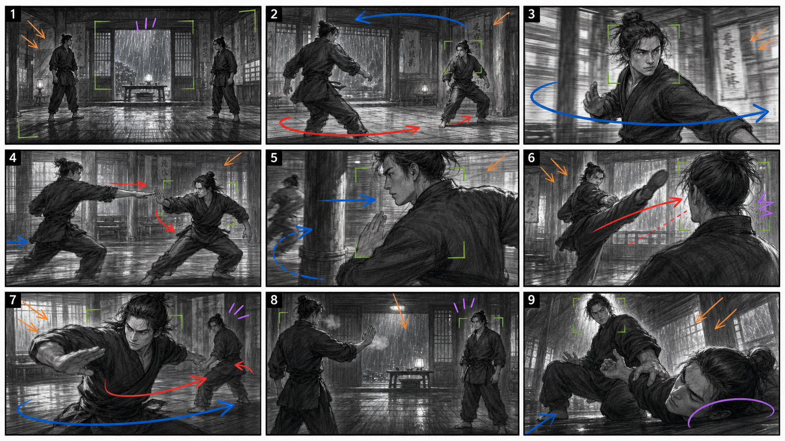

# Martial Arts Storyboard Preview

Generated with `$ai-action-director` plus `$ai-video-storyboard` as a first visual test of a routed martial-arts action storyboard.

## Route

- Scene intent: martial arts duel, staged non-graphic action
- Primary techniques: `11.1 Circle`, `5.3 Pan plus step`, `1.3 Track with the actor`
- Support techniques: `1.1 Long-lens effect`, `5.6 Actor and camera turn together`, `8.5 Stop walking`, `1.8 Victory moment`

## Output



## Storyboard Prompt

```text
Create one horizontal 16:9 director storyboard contact sheet using a 9-panel film layout, 3 columns by 3 rows.

Style: rough black-and-white pencil storyboard sketch, cinematic director thumbnails, clear silhouettes, readable spatial relations, loose production drawing quality, not polished comic art, not a poster, not final color art.

Scene: a staged, safe, non-graphic Chinese martial arts duel inside an old wooden training hall at night. Rain streaks on the windows, wet stone threshold, hanging cloth banners, a low table and wooden pillars define the geography. Two adult martial artists in simple dark training clothes, no weapons, no blood, no real contact. Impact is implied by camera angle, motion blur, body reaction, and safe choreographed distance.

Storyboard route and beats:
Panel 1: Wide establishing shot. Both fighters stand at opposite sides of the wooden floor, rain-lit windows behind them, clear left-right geography. Quiet tension before movement.
Panel 2: Technique 11.1 predator circle. Dominant fighter steps first in a slow arc; defender side-steps to keep face toward threat. Camera begins a slight orbit.
Panel 3: Technique 5.3 pan plus step. Fighter A crosses in a half-circle, camera pans with the face while the background pillars rotate behind them, building martial aura.
Panel 4: First test exchange. Medium-wide side tracking shot, clean silhouettes: a fast straight palm strike is slipped and redirected, no contact.
Panel 5: Technique 1.3 track with one actor. Close wide-lens tracking beside the defender as bodies move past a pillar; camera stays attached to defender's shoulder and footwork.
Panel 6: Technique 1.1 long-lens compressed impact illusion. A high kick appears to pass close to the opponent's head, hidden gap behind the shoulder, receiver reacts with a controlled head turn, no actual contact.
Panel 7: Technique 5.6 actor and camera turn together. Defender pivots from retreat into attack; camera pivots with them, rain light flashes across the floor, a power shift becomes visible.
Panel 8: Technique 8.5 stop walking / realization. Both fighters pause at a safe distance, one hand extended, breath visible, the attacker realizes the rhythm has changed.
Panel 9: Technique 1.8 victory moment. Non-graphic controlled finish: defender has opponent safely pinned at arm's length near the floor without injury; low angle isolates the winner, loser calm and defeated, rain-lit silence.

Annotations: use red arrows for fighter movement, blue arrows for camera movement, green marks for composition focus, orange marks for light direction, purple marks for emotion or sound emphasis. Add only simple black panel numbers 1-9 in the corners; avoid long captions or readable text.

Composition constraints: each panel must be visually distinct in shot size, camera position, body pose, and story state. Keep the same two characters and same training hall across all panels. Clear gutters between panels. No gore, no weapons, no broken anatomy, no random extra people, no extra limbs, no confusing geography, no graphic injury, no text other than panel numbers.
```
